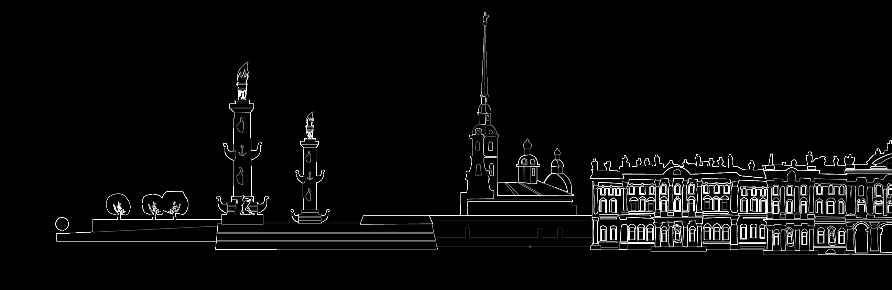

### Как скомпилировать и запустить

```bash
$ ./sobel Piter.png Piter_siluet.png
Loading Piter.png...
Image loaded: 2594x844
Processing on GPU...
Result saved to Piter_siluet.png
```

В реализации использована https://github.com/nothings/stb для работы с png

### Результаты



