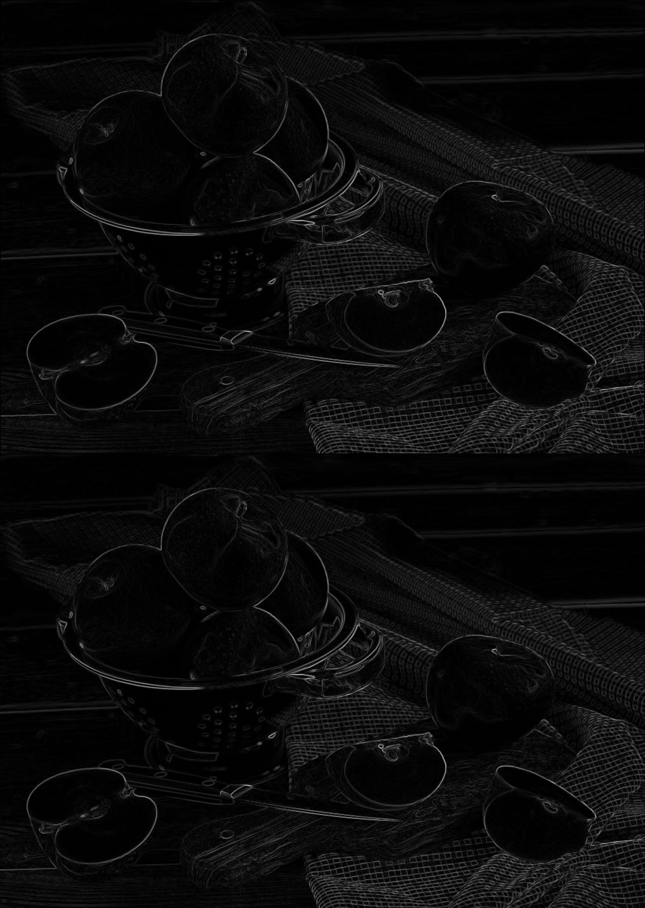
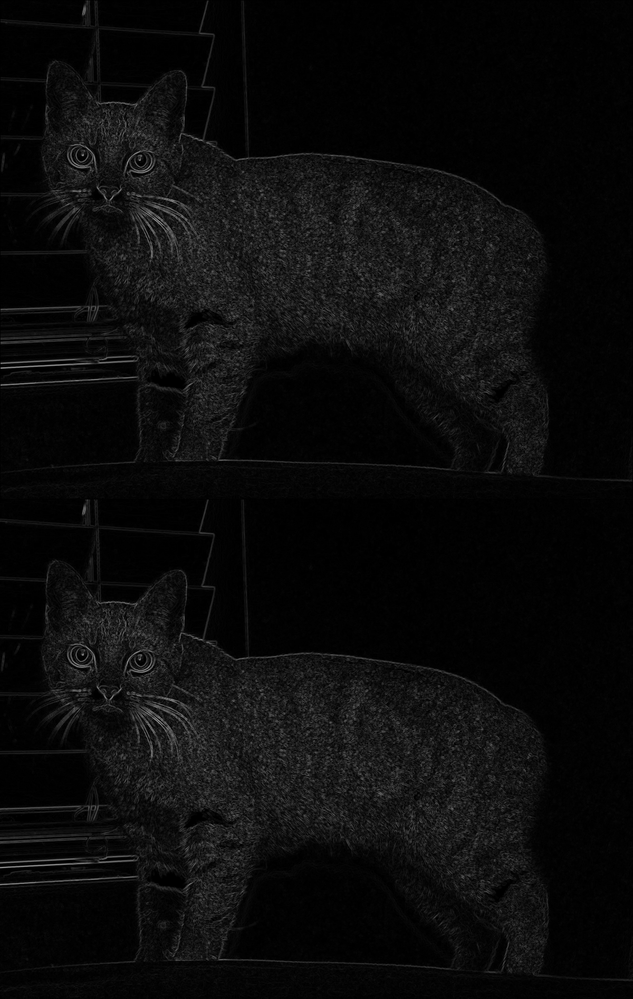

# Отчет по лабораторной работе №3

## 1. Задачи лабораторной работы

В лабораторной работе необходимо реализовать оператор Собеля на GPU для обнаружения границ на изображении. Также необходимо протестировать на изображениях и сравнить реализацию с вариантом на CPU.


## 2. Инструкция по запуску

**Требования**: `g++`, `nvcc`.

**Сборка**: `make build_sobel`

**Запуск**: `./build/sobel <путь_к_изображению>`. Результат работы с файлом сохраняется в исходную директорию, под названием с префиксом `sobel_`. На одном изображении собраны результаты работа на CPU (сверху) и на GPU (снизу).

Для чтения и записи изображения используются header-only библиотеки `stb_image.h` и `stb_image_write.h` ([источник](https://github.com/nothings/stb)).

## 3. Пример работы

### Входные данные
Использованы тестовые изображения из директории `assets/`. Изображения в верхней половине и нижней идентичны - результат работы на CPU и GPU одинаковый.





### Замеры времени
```
$ ./build/sobel assets/cat.png
Время работы на CPU: 0.194347 секунд.
Время работы на GPU без переноса данных: 0.00043 секунд.
Время работы на GPU с учетом обращений к памяти: 0.236897 секунд.
```

```
$ ./build/sobel assets/apple.png
Время работы на CPU: 0.117532 секунд.
Время работы на GPU без переноса данных: 0.00043 секунд.
Время работы на GPU с учетом обращений к памяти: 0.295594 секунд.
```


### Анализ производительности
На примере обработки изображения:
- **CPU**: ~0.11-0.19 секунд (зависит от размера изображения)
- **GPU (только вычисления)**: ~0.0004 секунд
- **GPU (с переносом данных)**: ~0.25 секунд

Очень много времени занимает перенос данных с CPU на GPU, однако при измерении времени самой операции время работы уменьшается примерно в 600 раз. 


## Выводы

Реализация фильтра Собеля на GPU с использованием CUDA демонстрирует значительное ускорение по сравнению с последовательной CPU-версией. Это связано с возможностью параллельной обработки множества пикселей одновременно, также использование текстур обеспечивает оптимизированный доступ к памяти.