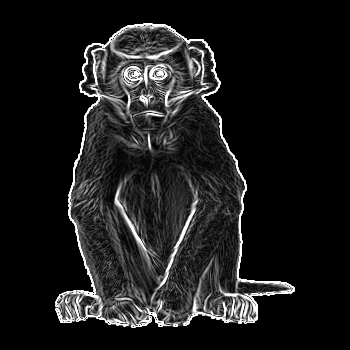
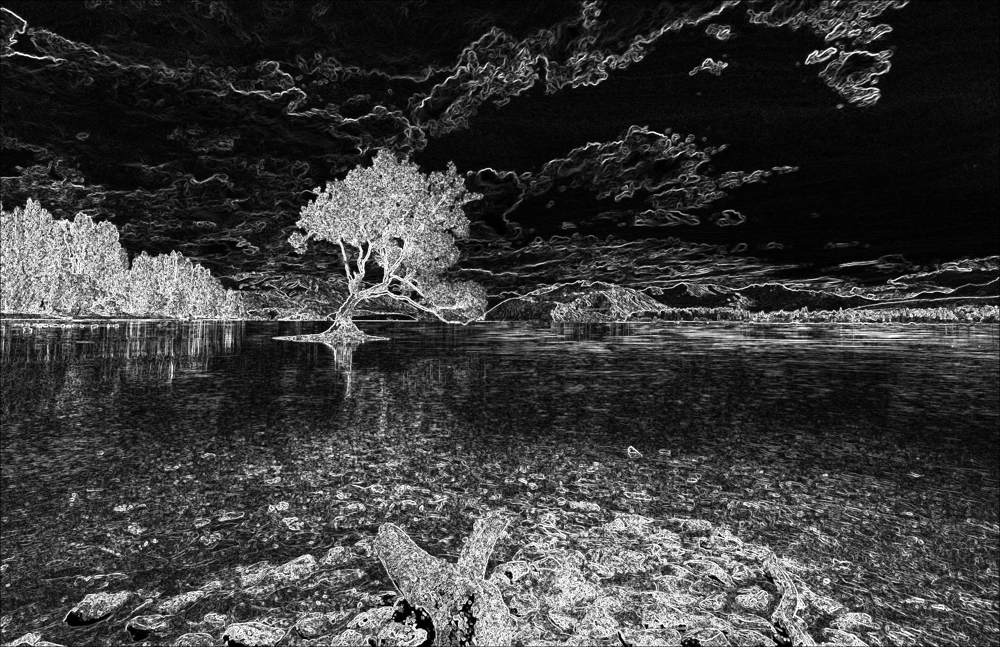

# Lab 3: Оператор Собеля

## Описание

Разработана реализация оператора Собеля для детектирования границ на изображениях с использованием параллельных вычислений на CUDA.

Обеспечена поддержка изображений в форматах PGM (P5) и PNG, а также корректная обработка изображений произвольного размера.

## Компиляция

Перед запуском необходимо скачать `lodepng.h` и `lodepng.cpp` с [официального сайта](https://lodev.org/lodepng/) и положить в папку `src/` для работы с PNG-изображениями.

```bash
make
```

## Запуск 

```bash
./sobel input.(png|pgm) output.(png|pgm)
```

## Результаты

* Программа корректно работает для форматов PNG и PGM
* Использование shared memory позволило сократить чисто чтений из глобальной памяти с 9 до 1 на пиксель

### Лена, PGM 512x512

```bash
./sobel lena.pgm lena_sobel.pgm

Время выполнения Sobel: 0.122944 мс (размер: 512x512)
Результат сохранён в: lena_sobel.pgm
```


### Обезьянка, PNG 350x350

```bash
./sobel monkey.png monkey_sobel.png
Время выполнения Sobel: 0.131552 мс (размер: 350x350)
Результат сохранён в: monkey_sobel.png
```




### 2K изображение, PNG 2048x1326

```bash
Время выполнения Sobel: 0.406496 мс (размер: 2048x1326)
Результат сохранён в: 2k_sobel.png
```




## Замечания

* Для краевых пикселей, где невозможно применить фильтр, устанавливается значение 0
* Ядро CUDA использует блоки размером 16x16 и shared memory размером 18x18 (по 1 пикселю с каждый стороны для тех самых нулей)
* Формат PGM должен быть бинарным (P5), текстовый (P2) не поддерживается
* Максимальный размер изображения ограничен доступной памятию GPU (примерно 10Kx10K на современных картах)
