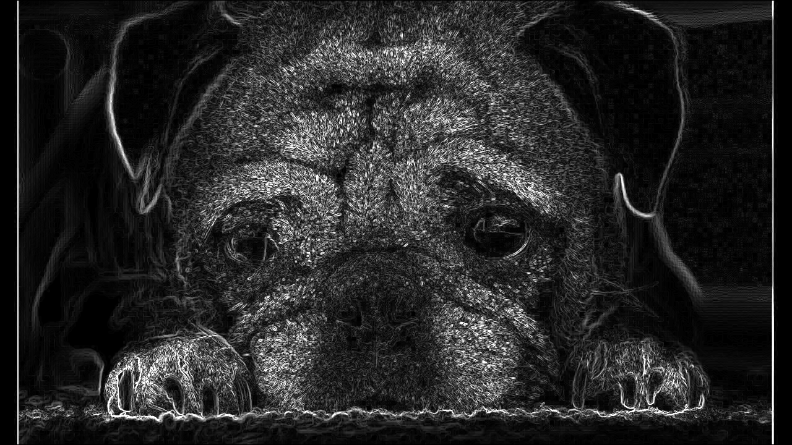

# Lab 3: Sobel Operator (Edge Detection)

## Задача
Реализовать фильтр Собеля для выделения границ на изображении с использованием CUDA и Shared Memory.

## Реализация
Использован подход **Tiled Convolution**:
1.  **Загрузка тайла**: Блок потоков (32x32) загружает фрагмент изображения в Shared Memory.
2.  **Halo (Padding)**: Учитываются границы тайлов. Размер Shared Memory `[32][33]` (с паддингом для избежания Bank Conflicts).
3.  **Вычисление**: Каждый поток вычисляет градиент только для внутренних пикселей тайла, используя соседей из быстрой Shared Memory.


## Пример работы

Исходное изображение 




## Запуск
```bash
make
./sobel_filter input.png output.png
```

