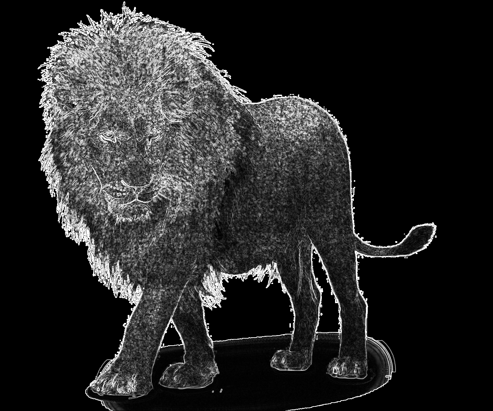
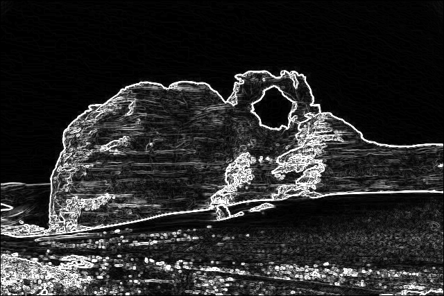
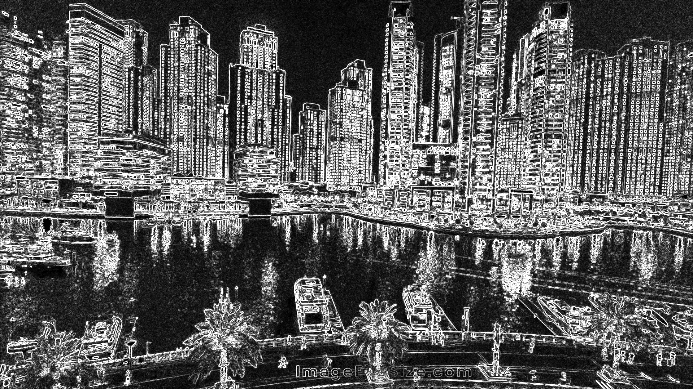

## Лабораторная 3

### Описание задачи

Реализовать фильтр Собеля для обнаружения границ в изображении на CUDA.

### Требования

- Поддержка загрузки изображений форматов PNG, BMP, PGM
- Работа с изображениями разных размеров
- Реализация оператора Собеля на GPU
- Сохранение результата в файл
- Тестирование на стандартных изображениях

### Компиляция

```make```

### Запуск

```./main input.pgm output```

input.pgm - название входного файла, output - название выходного файла без расширения

### Описание реализации

Ядро работает с блоками размером (TILE_SIZE+2)x(TILE_SIZE+2), где размер тайла представляет внутреннюю область для обработки, а дополнительные 2 пикселя с каждой стороны обеспечивают граничные значения для корректной свёртки 3x3.

Каждый поток в блоке загружает от 1 до 4 пикселей из глобальной памяти в shared memory, для покрытия граничных пикселей. После загрузки применяется синхронизация потоков.

Для каждого не граничного пикселя изображения выполняется свертка 3x3 с использованием двух ядер Собеля (горизонтального и вертикального). Горизонтальное ядро sobel_x выделяет вертикальные грани, а вертикальное ядро sobel_y — горизонтальные.

Результаты сверток по осям X и Y комбинируются в величину градиента magnitude через вычисление евклидовой нормы sqrtf(gx^2 + gy^2). Эта величина обрезается до диапазона от 0 до 255 и используется в выходном изображении.

### Вывод программы

Команда: ```./main data/lion.png data/out1```

Вывод: ```Saved: data/out1.png```

Оригинальное изображение: 

Результат применения фильтра: 

Команда: ```./main data/sample.bmp data/out2```

Вывод: ```Saved: data/out2.png```

Оригинальное изображение: 

Результат применения фильтра: 

Команда: ```./main data/HD.pgm data/out3```

Вывод: ```Saved: data/out3.png```

Оригинальное изображение: файл HD.pgm в /data

Результат применения фильтра: 

### Результаты

Программа реализует фильтр Собеля на GPU. С помощью библиотеки STB поддерживаются цветные и черно-белые входные изображения форматов PNG, BMP, PGM. Результат сохраняется в формате PNG.
